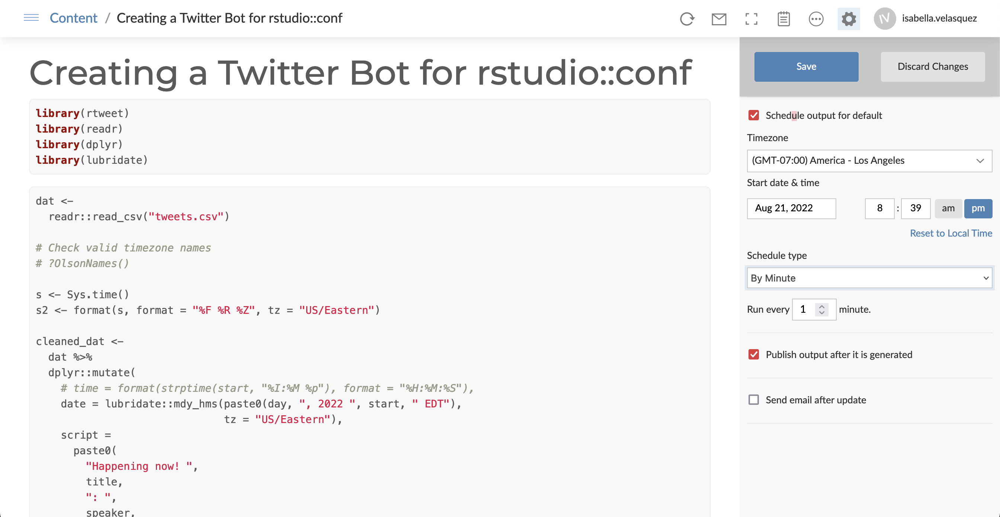

# Automate a Twitter bot with {rtweet} and RStudio Connect

This repository includes an example of automating a Twitter bot using {rtweet} and [RStudio Connect](https://www.rstudio.com/products/connect/).

Read about the workflow on RViews: [Automate a Twitter bot with the rtweet package and RStudio Connect](https://rviews.rstudio.com/2022/09/13/automate-a-twitter-bot-with-rtweet-and-rstudio-connect/)

